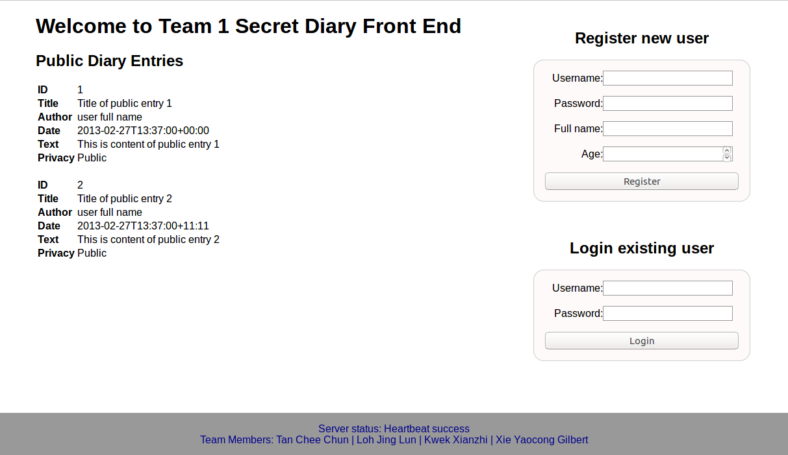
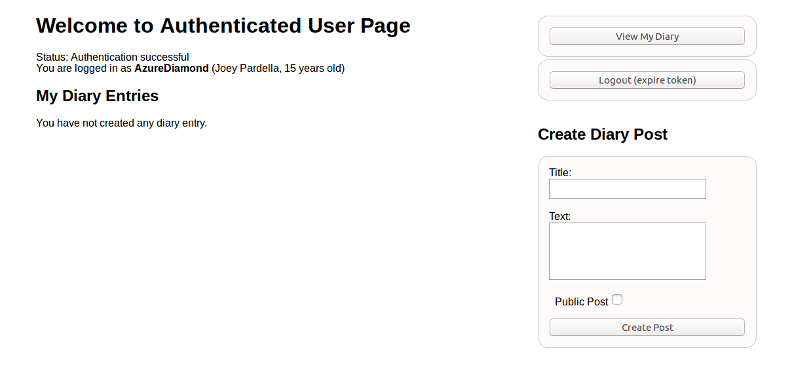
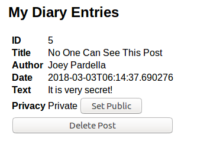
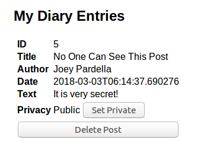

# rest-api-development

CS5331 Assignment 1 Project Reference Repository

## Instructions

Your objective is to implement a web application that provides the endpoints
specified here: https://cs5331-assignments.github.io/rest-api-development/.

The project has been packaged in an easy to set-up docker container with the
skeleton code implemented in Python Flask. You are not restricted in terms of
which language, web stack, or database you desire to use. However, please note
that very limited support can be given to those who decide to veer off the
beaten path.

You may be required to modify the following files/directories:

- Dockerfile - contains the environment setup scripts to ensure a homogenous
  development environment
- src/ - contains the front-end code in `html` and the skeleton Flask API code
  in `service`
- img/ - contains images used for this README

Assuming you're developing on an Ubuntu 16.04 machine, the quick instructions
to get up and running are:

```
# Install Docker

sudo apt-get update
sudo apt-get install \
    apt-transport-https \
    ca-certificates \
    curl \
    software-properties-common
curl -fsSL https://download.docker.com/linux/ubuntu/gpg | sudo apt-key add -
sudo add-apt-repository \
   "deb [arch=amd64] https://download.docker.com/linux/ubuntu \
   $(lsb_release -cs) \
   stable"
sudo apt-get update
sudo apt-get install docker-ce

# Verify Docker Works

sudo docker run hello-world

# Run the skeleton implementation

sudo ./run.sh
```

(Docker CE installation instructions are from this
[link](https://docs.docker.com/install/linux/docker-ce/ubuntu/#install-using-the-repository).)

**Please consult your assignment hand-out for detailed setup information.**

## Grading

The implementation will be graded in an automated fashion on an Ubuntu 16.04
virtual machine by building the docker container found in your repository and
running it. The grading script will interact with your API.

The following ports are expected to be accessible:

1. 80, on which static HTML content, including the front-end, is served.
2. 8080, on which the API is exposed.

To verify this, please run the following commands:

```
sudo ./run.sh
```

On a different window:

```
curl http://localhost:80
curl http://localhost:8080
```

If a response is received, you're good to go.

**Please replace the details below with information relevant to your team.**

## Screenshots

Please replace the example screenshots with screenshots of your completed
project. Feel free to include more than one.

**1. Main Page with Public Entries**



**2. Authenticated User Page**



**3. Private Diary Entry**



**4. Mark Private Entry Public**



## Administration and Evaluation

Please fill out this section with details relevant to your team.

### Team Members

1. Tan Chee Chun
2. Loh Jing Lun
3. Kwek Xianzhi
4. Xie Yaocong Gilbert

### Short Answer Questions

#### Question 1: Briefly describe the web technology stack used in your implementation.

Answer: SQlite for database. Python Flask for backend. Html and Javascript for front end.

#### Question 2: Are there any security considerations your team thought about?

Answer: 

1. Usage of HTTP. Traffic is unencrypted and third party can sniff it and even modify it. No data authenticity and integrity...  
2. Password is sent in clear when submitting forms
3. User input in authentication form fields are not sanitized.

#### Question 3: Are there any improvements you would make to the API specification to improve the security of the web application?

Answer: 
1. We do not assemble sql query string using Python’s string operations because it is vulnerable to an SQL injection attack. Instead, we use the DB-API’s parameter substitution.

#### Question 4: Are there any additional features you would like to highlight?

Answer:
1. We note that CORS is explictly enabled inside app.py to overcome Same Origin Policy (SOP) restriction, where API requests from http://localhost:80 to http://localhost:8080 may be prevented from running.

#### Question 5: Is your web application vulnerable? If yes, how and why? If not, what measures did you take to secure it?

Answer:
1. The json web service on port 8080 might be vulnerable as there are no authentication measures in place to verify the authenticity of the POST and GET messages it receives.

2. The messages are also sent in clear without any encryption, which means senstive information like password or secret diary post can still be seen.

#### Feedback: Is there any other feedback you would like to give?

Answer:
1. Always ensure the security principles of Confidentiality, Integrity and Availability are followed when developing a web application.

### Declaration

#### Please declare your individual contributions to the assignment:

1. Tan Chee Chun
	- Develop Back-end Server API
	- Design and implement Web frontend 
	- Answer Short question
2. Loh Jing Lun
	- Develop Back-end Server API
	- Design and implement Web frontend 
	- Answer Short question
3. Kwek Xianzhi
	- Develop Back-end Server API
	- Design and implement Web frontend 
	- Answer Short question
4. Xie Yaocong Gilbert
	- Develop Back-end Server API
	- Design and implement Web frontend 
	- Answer Short question


